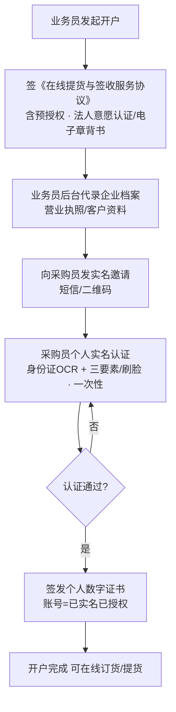

# 钢贸提货单实名签收系统 · 总体方案与业务流程

> 本文档为系列设计方案的总纲，描述业务背景、设计目标、整体架构与核心业务流程。
> 配套文档：
> - `02-合规与法律效力设计.md`
> - `03-产品设计.md`
> - `04-提单条款与合同文本模板.md`
> - `05-技术架构与存证证据链.md`
> - `06-成本测算与服务商选型.md`

---

## 1. 业务背景

- **行业**：钢材贸易（钢贸）。
- **场景**：客户（买方企业）到卖方仓库提货。客户通常**安排驾驶员上门提货**，驾驶员可能是买方员工，也可能是买方临时委托的第三方承运司机。
- **交易起点**：**不签独立购销合同，业务从"留货单"开始**。客户在线确认留货单（锁定品名/规格/数量/价格）后实际提货，即构成买卖合同关系。框架性条款由开户时一次性签署的《在线提货与签收服务协议》承载。
- **现行做法**：
  - 提货前由客户做"提货前确认"，表示该企业前来提货，条款中标注"以实际提货为准"。
  - **货物从仓库出去（驶离）即视为确认交付**。
  - 提货后不再签字，卖方将**结算单**发给客户，客户在 T+N 工作日内无异议即视为确认收货。
- **痛点**：
  1. 传统企业实名认证手续繁琐，部分客户嫌麻烦放弃交易，影响业务推广。
  2. 拿货的是驾驶员，可能非买方员工，**授权链易断**。
  3. "出库即确认""沉默视为确认"缺乏稳固的法律与证据支撑。
  4. 实名认证成本需严格控制（企业实名、员工实名各 ≤ 0.5 元）。

---

## 2. 设计目标

| 目标 | 衡量标准 |
|---|---|
| 法律有效 | 签署/提货行为构成《电子签名法》下的可靠电子签名，纠纷可出具司法存证报告 |
| 体验极简 | 客户端核心操作 ≤ 2 步；驾驶员端尽量零摩擦 |
| 成本可控 | 实名认证为一次性成本，企业/员工实名各 ≤ 0.5 元 |
| 授权可靠 | 第三方驾驶员提货行为可稳固绑定到买方企业 |
| 证据闭环 | "谁授权、谁提货、提多少、何时出库、风险何时转移"全程可证 |

---

## 3. 核心设计理念（三句话）

1. **实名与法律效力分离**：实名认证解决"你是谁"（一次性、低成本）；法律效力靠"可靠电子签名 + 时间戳 + 存证"。
2. **把实名放在"经办人下指令"，把执行交给"提货码"**：买方实名经办人在线发起提货指令并生成一次性提货码，驾驶员凭码提货，授权链牢牢挂在实名经办人身上。
3. **企业实名做减法**：用《在线提货与签收服务协议》预授权条款替代繁琐的企业实名与购销合同，企业资料由钢贸业务员后台代办，客户端无感。
4. **确认合并、避免遗漏**：因"出库即确认"，**收货/交付确认不单设事后步骤**，其认可语前置并入"提货指令确认"一次完成；收货确认随"出库事件 + 结算单异议期"自动成立，经办人无需事后操作。

---

## 4. 四层身份与签署体系

```
企业关系层（一次性）
  └─ 开户签《在线提货与签收服务协议》(含预授权，法人意愿认证/电子章背书)
     + 业务员代录企业档案（替代繁琐企业实名与购销合同）
        │
经办人层（一次性，每个采购员/老板）
  └─ 个人实名认证（身份证OCR + 三要素/人脸）+ 个人数字证书
        │
订货层（每笔业务）
  └─ 经办人在线确认留货单（锁货 + 引用服务协议条款）
        │
授权指令层（每次提货）
  └─ 经办人实名发起「提货指令暨收货确认」→ 生成一次性提货码（绑定车牌/数量/时段）
        │
执行交付层（每次提货）
  └─ 驾驶员凭提货码到场 → 仓库核验 → 过磅出库 → 驶离即确认
```

---

## 5. 端到端业务流程

### 5.1 开户阶段（一次性，业务员主导，客户低感知）



### 5.2 订货与提货阶段（每笔业务）

```mermaid
flowchart TD
    O[经办人在线确认留货单<br/>锁货 + 引用服务协议条款] --> A[经办人(已实名)发起「提货指令暨收货确认」]
    A --> B[填写 车牌/司机/数量/有效时段<br/>一次性确认: 授权提货 + 预认可出库即确认/结算异议期]
    B --> C[系统电子签署 + 生成一次性提货码<br/>可信时间戳存证]
    C --> D[提货码发给司机或经办人]
    D --> E[司机到场]
    E --> F[仓库核验 提货码 + 车牌识别<br/>大额:司机扫码留痕/人脸]
    F --> G{核验通过?}
    G -- 否 --> E
    G -- 是 --> H[过磅 + 生成出库单]
    H --> I[车辆驶离仓库]
    I --> J["★出库即确认<br/>交付完成 + 风险转移<br/>抓拍闸口/车牌/过磅/视频 存证"]
    J --> K[结算单推送(可举证送达)]
    K --> L{T+N 工作日内异议?}
    L -- 无异议 --> M[数量金额最终确认]
    L -- 有异议 --> N[转人工对账]
```

### 5.3 三个法律时点

| 时点 | 法律意义 | 依据 |
|---|---|---|
| 经办人确认留货单 | 买卖合同关系成立、认可服务协议条款 | 留货单 + 在线确认 + 服务协议 |
| 经办人发起「提货指令暨收货确认」 | 买方授权成立（含对第三方司机的授权）+ 预先认可出库/结算确认 | 服务协议预授权条款 + 可靠电子签名 |
| 货物驶离仓库（出库） | 交付完成、风险转移、收货确认成立 | 《民法典》第604条 + 自提交付条款 |
| 结算单送达后 T+N 无异议 | 数量与金额最终确认 | 《民法典》第621条 + 异议期条款 |

---

## 6. 各角色职责

| 角色 | 职责 | 是否需实名 |
|---|---|---|
| 钢贸业务员 | 开户、代录企业档案、生成提货单 | 内部账号 |
| 买方经办人（采购员/老板） | 个人实名一次；每次提货线上发起指令、生成提货码 | ✅ 一次性实名 |
| 驾驶员 | 凭提货码到场提货 | 常规免实名；大额留痕/人脸 |
| 仓管/磅房 | 核验提货码与车牌、过磅、出库放行 | 内部账号 |

---

## 7. 方案优势总结

- **客户低门槛**：企业实名免除，采购员仅刷脸一次，提货线上几步完成。
- **法律稳固**：实名电子签名 + 合同预授权 + 出库存证 + 异议期，多重支撑。
- **第三方司机可控**：提货码机制把临时司机的提货行为绑回实名经办人。
- **成本可控**：实名为一次性成本，单价 ≤ 0.5 元；日常签署用短信验证码（分级）。
- **证据闭环**：每次提货自动归集完整证据链，可一键出证。
