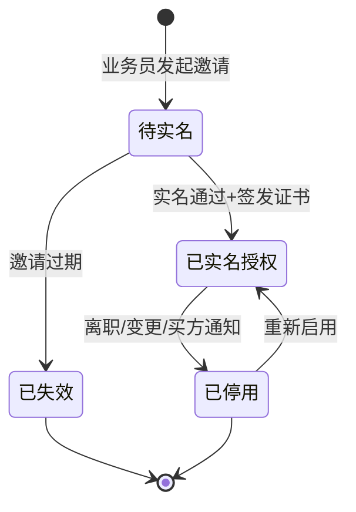
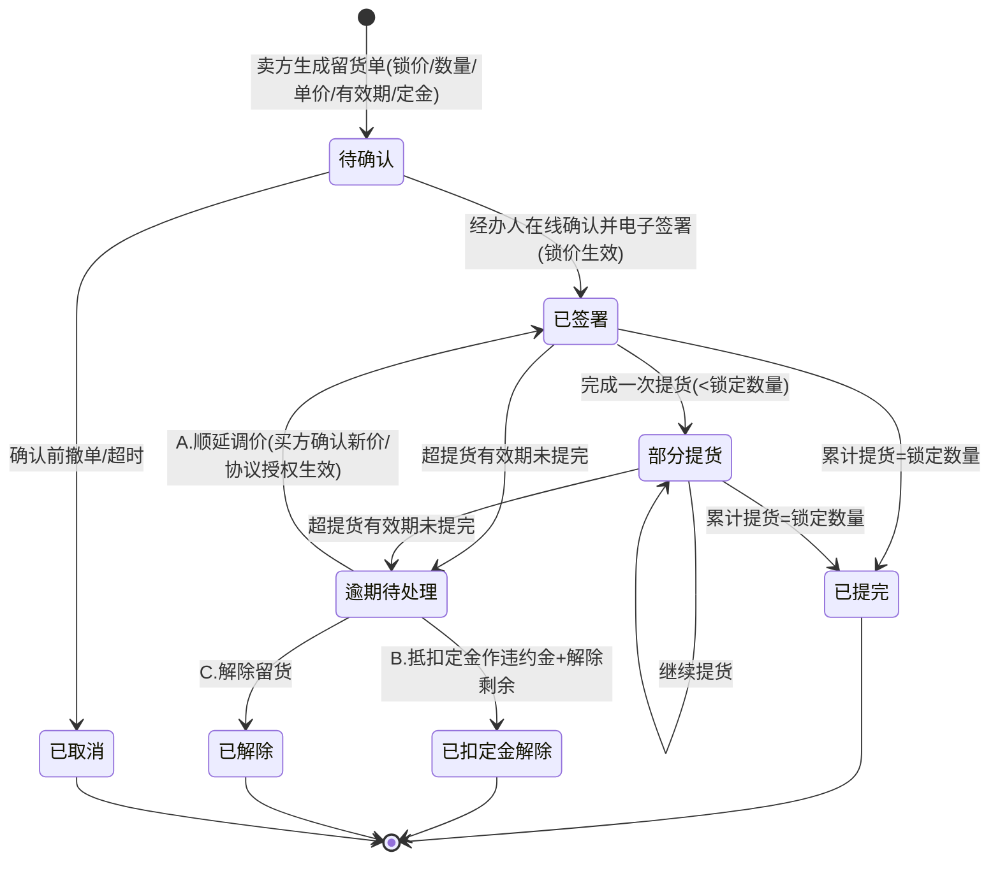
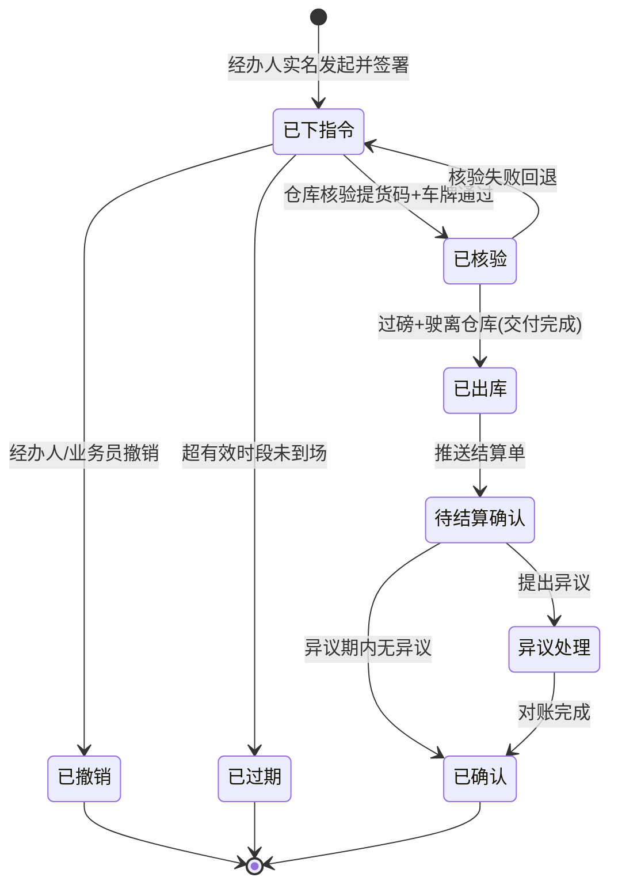

# 钢贸提货单实名签收系统 · 产品设计

> 本文覆盖：角色与权限、核心功能模块、提货码机制、页面流、状态机、数据模型、风险分级。

---

## 1. 角色与权限

| 角色 | 端 | 主要权限 |
|---|---|---|
| 平台管理员 | Web 后台 | 系统配置、CA/存证服务配置、风控规则、对账 |
| 钢贸业务员/客户经理 | Web 后台 | 开户、企业档案录入、生成提货单、邀请经办人 |
| 仓管/磅房 | Web/PDA | 提货码核验、过磅录入、出库放行 |
| 买方经办人（采购员/老板） | 移动端（小程序/H5/App） | 实名认证、发起提货指令、生成提货码、查看回执、提结算异议 |
| 买方管理员（法人/负责人，可选） | 移动端 | 管理本企业经办人、停用/启用账号 |
| 驾驶员 | 出示提货码（无需登录） | 凭码提货；大额场景扫码留痕/人脸 |

---

## 2. 核心功能模块

```
┌──────────────────────────────────────────────┐
│ 1. 企业与经办人管理   2. 实名认证中心          │
│ 3. 提货指令与提货码   4. 仓库核验与出库         │
│ 5. 电子签署与存证     6. 结算单与异议管理       │
│ 7. 风控规则引擎       8. 证据中心与出证         │
│ 9. 通知与送达         10. 对账与报表            │
└──────────────────────────────────────────────┘
```

### 2.1 企业与经办人管理
- 业务员录入企业档案（营业执照 OCR、统一社会信用代码、法人信息、客户编号）。
- 关联《在线提货与签收服务协议》（开户一次性电子签署，法人意愿认证/电子章背书），标记预授权条款已签署；**不依赖独立购销合同**。
- 留货单管理：经办人在线确认留货单（锁货 + 引用服务协议条款），作为提货的前序单据；含**逾期处理**（到期提醒、调价/定金抵扣/解除三分支、通知送达、存证）。
- 邀请/管理经办人，支持停用、变更、授权范围限制（如单笔吨数上限）。

### 2.2 实名认证中心
- 个人实名：身份证 OCR → 身份二要素/运营商三要素 → （首次或大额）人脸核身。
- 实名结果一次性，长期复用；签发个人数字证书。
- 认证渠道可切换（自建 API / 第三方电子签平台），便于成本与可用性切换。

### 2.3 提货指令与提货码（核心，见第 3 节）

### 2.4 仓库核验与出库
- 仓管输入/扫描提货码 → 系统校验有效性、车牌、数量、时段。
- 车牌识别（摄像头）自动比对。
- 过磅录入（对接磅房系统获取毛重/皮重/净重）。
- 出库放行，记录出库时间戳。

### 2.5 电子签署与存证
- 提货指令、出库回执自动用经办人数字证书签署 + 时间戳 + 存证。

### 2.6 结算单与异议管理
- 出库后生成结算单，多渠道送达并记录送达证据。
- 异议期倒计时，到期无异议自动置为"已确认"。

### 2.7 风控规则引擎
- 按货值、设备、经办人历史、车牌等维度判定意愿认证强度（短信/人脸）。

### 2.8 证据中心与出证
- 按提货单聚合全证据链，一键生成存证报告/出证申请。

---

## 3. 提货码机制（核心设计）

### 3.1 定义
**提货码**是买方实名经办人在线发起提货指令后，由系统生成的一次性授权凭证，绑定本次提货的车牌、数量、有效时段，作为驾驶员到场提货的授权依据。

### 3.2 生成规则
- 由经办人发起提货指令后生成，**指令本身经经办人数字证书签署 + 时间戳存证**。
- 提货码内容（核验时校验）：

| 字段 | 说明 |
|---|---|
| pickup_code | 提货码（短码 + 二维码，建议 8~12 位，含校验位） |
| enterprise_id | 买方企业 |
| operator_id | 发起的实名经办人 |
| plate_no | 绑定车牌号（必填） |
| driver_name | 司机姓名（可选，大额必填） |
| goods_spec | 品名/规格 |
| quantity | 授权提货数量（上限） |
| valid_from / valid_to | 有效时段 |
| warehouse_id | 提货仓库 |
| status | 状态（见状态机） |

### 3.3 安全设计（防套用/防转借）
- **一次一码**：核销后即失效，不可重复使用。
- **绑定车牌**：仓库车牌识别与提货码车牌不一致则拦截。
- **有效时段**：超时自动过期，需经办人重新发起。
- **数量上限**：实提数量超授权数量需经办人二次确认或拦截。
- **防截图转借**：二维码动态刷新（如 60s 滚动）或核验时附带短信动态码。
- **黑名单/限频**：异常车牌、异常频次触发风控。
- **撤销**：经办人/业务员可在核销前撤销提货码。

### 3.4 核销逻辑
```
生成 → (发给司机/经办人) → 仓库扫码核验 → 校验[有效期/车牌/数量/状态]
   通过 → 标记"核验通过/锁定" → 过磅出库 → 核销(置为已出库) 
   失败 → 记录失败原因，可重试或转人工
```

### 3.5 与仓库系统（WMS/磅房）对接字段
| 方向 | 字段 |
|---|---|
| 平台 → WMS | 提货码、企业、车牌、品名规格、授权数量、有效时段 |
| WMS/磅房 → 平台 | 实际毛重/皮重/净重、过磅时间、出库单号、出库时间、磅单照片 |

---

## 4. 页面流

### 4.1 经办人移动端
```
[登录/扫码进入]
   → (首次)[实名认证页: 身份证OCR + 三要素/刷脸 + 授权同意]
   → [我的提货单/首页]
   → [留货单确认页: 锁货 + 勾选适用服务协议条款]（如该业务有留货单）
   → [发起提货指令页: 选留货单/选货/填车牌/司机/数量/时段]
   → [确认与签署页(合并): 展示指令内容 + 出库即确认/结算异议期认可语 + 短信码/刷脸 一次确认]
   → [提货码页: 二维码 + 短码, 可分享给司机]
   → [提货进度/回执页: 已核验→已出库→结算单→确认状态]
```

### 4.2 仓管/磅房端
```
[核验工作台]
   → [扫描/输入提货码]
   → [校验结果页: 车牌比对/数量/时段, 异常拦截提示]
   → [过磅录入页: 毛重/皮重/净重(可自动获取)]
   → [出库放行确认 → 记录出库时间戳]
```

### 4.3 业务员后台
```
[客户管理] → [新建开户: 企业档案 + 关联合同] → [邀请经办人]
[提货单管理] → [生成/查看提货单] → [结算单生成与送达]
[证据中心] → [按提货单查看证据链 / 出证]
```

---

## 5. 状态机

### 5.1 经办人账号


### 5.2 留货单（锁价 + 逾期处理）


> 说明：A/B/C 三个分支均需"通知可举证送达"后生效，并写入证据链；调价分支优先回到「已签署·新价」。

### 5.3 提货单 / 提货码


---

## 6. 数据模型（核心实体）

```
Enterprise        企业(买方)      id, name, uscc, legal_person, customer_no, status
Operator          经办人          id, enterprise_id, name, id_card, mobile, realname_status,
                                  cert_id, auth_scope(max_qty), status
ServiceAgreement  在线提货签收服务协议 id, enterprise_id, file_hash, clauses_flags,
                                  legal_person_auth(意愿认证/电子章), sign_status, signed_at
HoldNote          留货单          id, enterprise_id, operator_id, goods_spec, qty, unit_price,
                                  total_amount, deposit, valid_until(提货有效期),
                                  overdue_rule_ref(逾期条款引用), agreement_version(服务协议版本),
                                  confirmed_at, will_auth(短信/人脸), sign_evidence_id,
                                  status(待确认/已签署/已提完/已逾期/已解除)
PickupOrder       提货单/指令     id, enterprise_id, operator_id, pickup_code, plate_no,
                                  driver_name, goods_spec, auth_qty, valid_from, valid_to,
                                  warehouse_id, status, sign_evidence_id
WeighRecord       过磅记录        id, pickup_order_id, gross, tare, net, weigh_time, photo
Outbound          出库记录        id, pickup_order_id, outbound_no, outbound_time, gate_capture
Settlement        结算单          id, pickup_order_id, qty, amount, delivered_at,
                                  deliver_channel, deliver_evidence, objection_deadline, status
Evidence          证据            id, pickup_order_id, type, hash, timestamp, chain_tx
RealnameRecord    实名记录        id, operator_id, method, result, face_log_ref, created_at
```

---

## 7. 风险分级规则（意愿认证强度）

| 维度 | 低风险 → 短信验证码 | 高风险 → 人脸核验 |
|---|---|---|
| 货值/数量 | 常规额度内 | 超大额/超授权 |
| 设备 | 常用设备 | 新设备/异地登录 |
| 经办人 | 老经办人、历史正常 | 新经办人首单 |
| 车牌 | 历史常用车牌 | 新车牌/黑名单临近 |
| 频次 | 正常频次 | 短时间高频 |

> 规则可配置，命中任一高风险项即升级为人脸核验，兼顾成本与安全。

---

## 8. 异常与边界处理

| 异常 | 处理 |
|---|---|
| 实提数量 > 授权数量 | 拦截，经办人线上追加确认或调整提货码 |
| 车牌不符 | 拦截，转人工/重新发起 |
| 提货码过期 | 经办人重新发起 |
| 司机临时更换 | 经办人重新发起或修改提货码（核销前可改） |
| 结算单客户称未收到 | 以送达证据链举证；多渠道冗余送达 |
| 网络/系统故障 | 仓库降级流程：纸质提货单 + 事后补录存证 |
